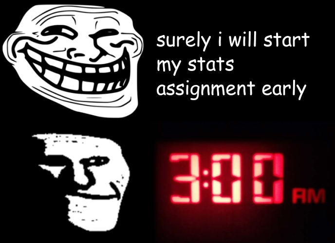

# Memes

&This file contains my meme, created using the R package magick, as well as the code used to create it.&



## Concept

For this meme, I have taken inspiration from the recent resurgence of the trollface, along with variants such as the sad trollface
used in this meme. The caption and idea comes from my own experience with assignments at uni, where I always would like to start them early,
but inevitably end up leaving them until the last night before they are due.

## Code

```
library(magick)

trollge <- image_scale(image_read(path = "https://i.kym-cdn.com/photos/images/newsfeed/001/996/641/bc2.jpg"), "x250")
troll <- image_scale(image_read(path = "https://upload.wikimedia.org/wikipedia/en/9/9a/Trollface_non-free.png"), "x250")
time <- image_scale(image_read(path = "https://mindfullivingnetwork.com/wp-content/uploads/2019/04/3am.jpg"), "x250")
blank <- image_blank(width = 387, height = 250, color = "#000000") %>%
  image_annotate("surely i will start" , size = 40, color = "white", location = "+20+50", font = "ComicSans") %>%
  image_annotate("my stats" , size = 40, color = "white", location = "+20+100", font = "ComicSans") %>%
  image_annotate("assignment early" , size = 40, color = "white", location = "+20+150", font = "ComicSans")

top_imgs <- image_append(c(troll, blank))
bot_imgs <- image_append(c(trollge, time))

imgs <- image_append(c(top_imgs, bot_imgs), stack = TRUE)

c(image_blank(width = 688, height = 500, color = "#000000"), imgs) %>%
  image_mosaic() %>%
  image_write("my_meme.png")

```
